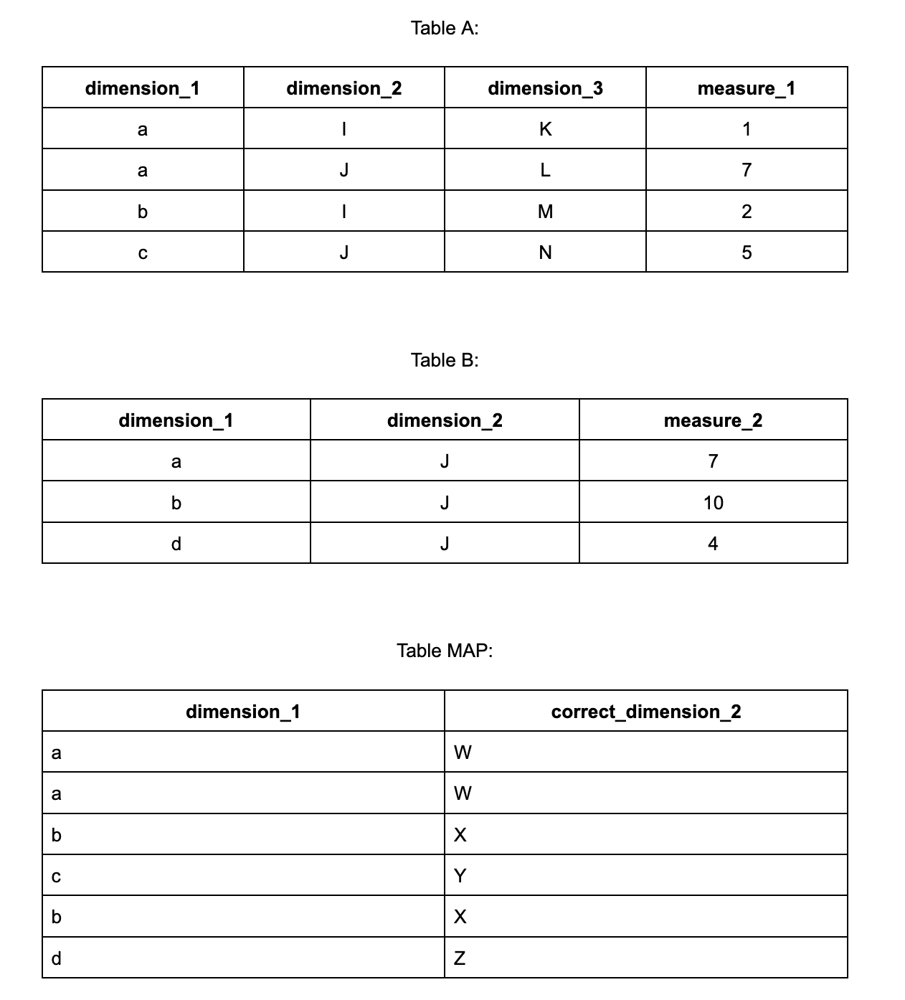

## Summary
The aim of this task is to create an SQL query that contains aggregations of measure_1 and measure_2 for distinct pairs of dimension_1 and dimension_2. Source tables A and B are attached below. (to aggregate use SUM)

### Task specification
The result of this task should be a single query, however you can use partial Common Table Expressions
Result table should contain four columns:
- dimension_1
- dimension_2 
- measure_1
- measure_2

In tables A and B dimension_2 values are incorrect - those wrong values should be mapped to correct values using the MAP table 
There should not appear any NULL values in the result table (for measures NULL should be replaced with 0)
Query has to be based on MySQL/MSSQL/PostgreSQL/SnowSQL syntax
The result of this task should be a single query (however you can use Common Table Expressions) 

### How to submit
Create a public Git repository and share the link with us.

